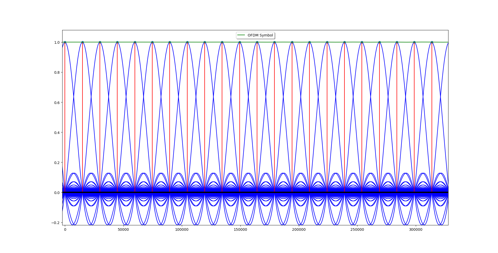
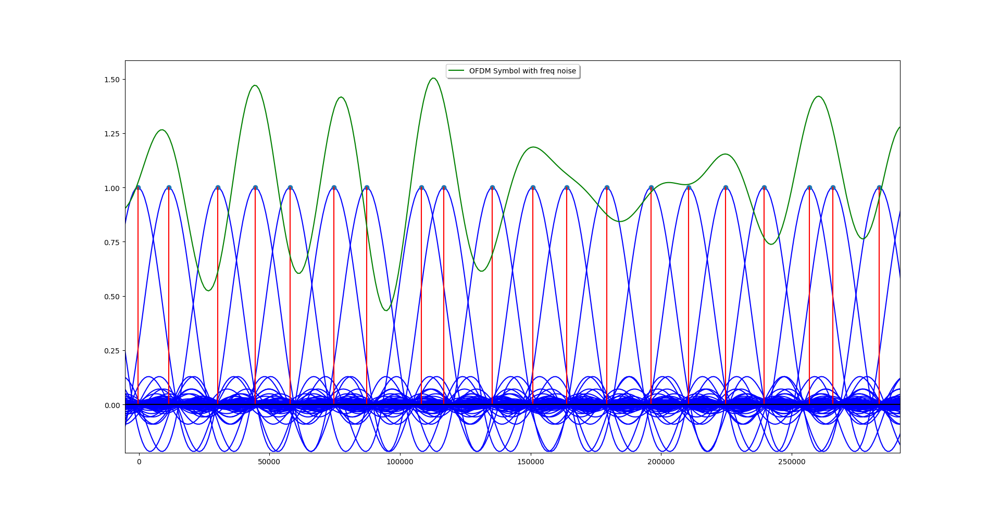

# OFDM_Sim
Small Python simulations for building OFDM symbols.

Plots Generated by Script:
1. Few sub-carriers of the OFDM symbol showing orthogonal spacing between the sub-carriers.

2. Few Sub-Carriers of OFDM symbol with Fractional Carrier Frequency Offset.

